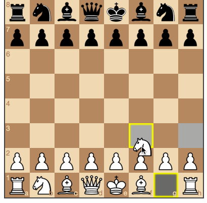
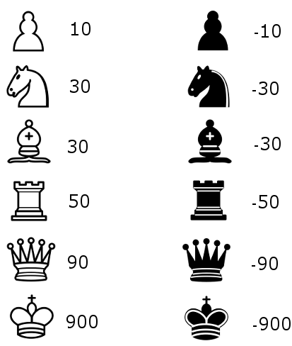
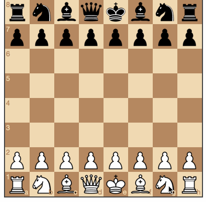
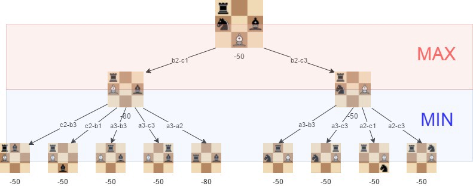
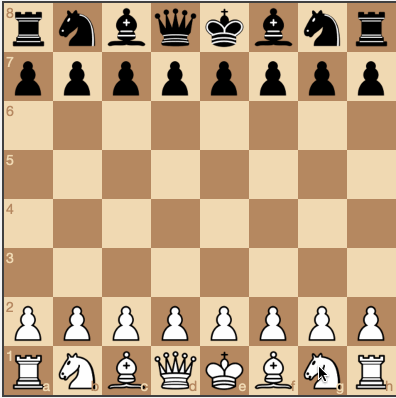
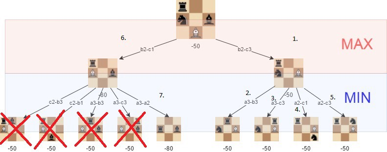
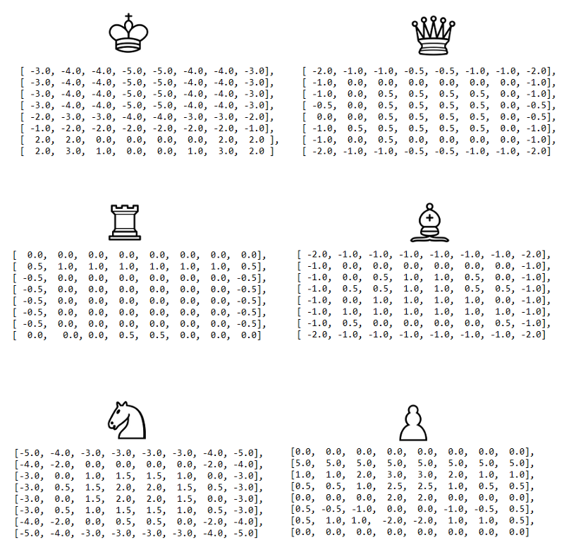

# Minimax with Alpha-Beta Pruning Chess AI

⭐ α-β 剪枝优化 Minimax 算法国际象棋 AI ⭐

🔗 [GitLab (Homepage)](https://gitlab.soraharu.com/XiaoXi/Minimax-with-Alpha-Beta-Pruning-Chess-AI) | 🔗 [GitHub](https://github.com/yanranxiaoxi/Minimax-with-Alpha-Beta-Pruning-Chess-AI)

## ✨ 特性

- 纯 JavaScript 代码，浏览器驱动
- Minimax 算法
- α-β 剪枝优化，极低性能占用
- 完全编程过程记录，并提供分步指南

## 📄 构建国际象棋 AI 的分步指南

让我们来了解一些基本概念，这些概念将帮助我们创建一个简单的国际象棋 AI：

- 生成棋子移动
- 评估位置得分
- Minimax 算法
- α-β 剪枝优化

在每一个步骤中，我们将使用经过时间考验的国际象棋编程技术来逐渐改进我们的算法，并且我将演示每个算法对国际象棋游戏的影响。

你可以在 [https://minimaxchessai.soraharu.com/](https://minimaxchessai.soraharu.com/) 体验最终的 AI 算法。

### 步骤 1：随机移动

我们将使用 [chess.js](https://github.com/jhlywa/chess.js) 库生成棋子移动，并使用 [chessboard.js](https://github.com/oakmac/chessboardjs) 来可视化棋盘。移动生成库基本上实现了国际象棋的所有规则，基于此，我们可以计算给定棋盘状态下的所有合法移动。

> 移动生成函数的可视化。起始位置用作输入，输出是从该位置移动的所有可能。

使用这些库将帮助我们只关注最重要的事：**创建找到最佳移动的算法**。

我们首先需要创建一个函数，该函数仅从所有可能的移动中返回随机移动。虽然这时的 AI 并不是一个非常可靠的棋手，但它是一个很好的起点，因为我们已经可以与它对抗：

> 黑方随机移动，你可以在 [https://codepen.io/yanranxiaoxi/pen/yLpGdYr](https://codepen.io/yanranxiaoxi/pen/yLpGdYr) 上尝试。

### 步骤 2：评估位置得分

现在让我们试着教会 AI 如何移动可以获得更大的优势，实现这一点的最简单方法是使用下表计算棋盘上棋子的相对优势：

使用评估函数，我们能够创建一个算法，该算法选择获得最多优势的移动。现在，我们的 AI 会优先选择能够吃掉对方棋子的移动：

> 黑方借助于简单的评估函数进行游戏，你可以在 [https://codepen.io/yanranxiaoxi/pen/QWaYLpO](https://codepen.io/yanranxiaoxi/pen/QWaYLpO) 上尝试。

### 步骤 3：Minimax 算法

接下来，我们将创建一个搜索树，使得 AI 可以选择最佳的移动，这是通过 [Minimax 算法 (极小极大算法)](https://zh.wikipedia.org/wiki/%E6%9E%81%E5%B0%8F%E5%8C%96%E6%9E%81%E5%A4%A7%E7%AE%97%E6%B3%95) 实现的。

在该算法中，对所有可能移动的递归树进行一定深度的搜索，并在树的末端“叶子”处评估该位置的优势。

之后，我们将子节点的最小值或最大值返回给父节点，这取决于要移动的是白方还是黑方。（也就是说，我们试图在每个层面上最小化或最大化结果。）

> 这是一个特殊例子上的 Minimax 算法的可视化。对于白方来说，最好的选择是 `b2-c3`，因为我们可以保证我们可以得到一个评估优势为 `-50` 的结果。

有了 Minimax，我们的 AI 开始理解国际象棋的一些基本策略：

> 计算深度为 `2` 的 Minimax 算法，你可以在 [https://codepen.io/yanranxiaoxi/pen/bGazbKY](https://codepen.io/yanranxiaoxi/pen/bGazbKY) 上尝试。

Minimax 算法的有效性在很大程度上取决于我们能达到的计算深度，这是我们将在接下来的步骤中改进的内容。

### 步骤 4：α-β 剪枝优化

[α-β 剪枝](https://zh.wikipedia.org/wiki/Alpha-beta%E5%89%AA%E6%9E%9D) 是 Minimax 算法的优化方法，它允许我们忽略搜索树中的某些分支，这有助于我们在使用相同的资源的同时更深入地评估 Minimax 搜索树。

α-β 剪枝基于这样一种情况：如果我们发现一个移动会导致比以前评估的移动更糟糕的情况，我们可以停止评估搜索树的一部分。

α-β 剪枝并不会影响 Minimax 算法的结果，它只会让它更快。

如果我们碰巧 **首先** 评估了那些良好的移动，α-β 剪枝会使 Minimax 算法更有效率。

> 如果使用了 α-β 剪枝，则不需要评估这些位置，并且按照标号顺序访问树。

使用 α-β 剪枝，我们可以显著提升 Minimax 算法的性能，如以下示例所示：

> 以上为计算深度为 `4` 且初始位置如图的搜索，需要评估的位置数量。

[点击这里](https://codepen.io/yanranxiaoxi/pen/vYpbYOm) 尝试由 α-β 剪枝优化后的国际象棋 AI。

### 步骤 5：改进评估功能

最初的评估功能非常简单，因为我们只计算在棋盘上找到的数据，为了改善这一点，我们在评估中加入了一个考虑棋子位置的因素。例如，位于棋盘中央的骑士比位于棋盘边缘的骑士更好（因为它后续会有更多的活动空间）。

我们将使用一个稍微调整过的最初在国际象棋维基中描述的棋子-方格表。

> 可视化的棋子-方格表。我们可以根据棋子的位置，增加或减少评估优势。

通过以下改进，我们开始得到一种算法，至少从一个普通玩家的角度来看，它可以下一些“像样的”国际象棋：

> 改进的评估功能与 α-β 剪枝优化，计算深度为 `3`，你可以在 [https://codepen.io/yanranxiaoxi/pen/YzYBzpQ](https://codepen.io/yanranxiaoxi/pen/YzYBzpQ) 上尝试。

### 结论

即使这个简单的国际象棋 AI 有着不会犯愚蠢错误的优势，但是它仍然缺乏战略意识。

通过我在这里介绍的方法，我们已经能够编写一个国际象棋程序，可以实现基本的国际象棋游戏算法。最终算法的“AI”部分只有不到 200 行代码，这意味着基本概念很容易实现，你可以在我的 [GitLab](https://gitlab.soraharu.com/XiaoXi/Minimax-with-Alpha-Beta-Pruning-Chess-AI) 上查看最终版本。

感谢你的阅读！

## 📜 开源许可

基于 [MIT License](https://choosealicense.com/licenses/mit/) 许可进行开源。
